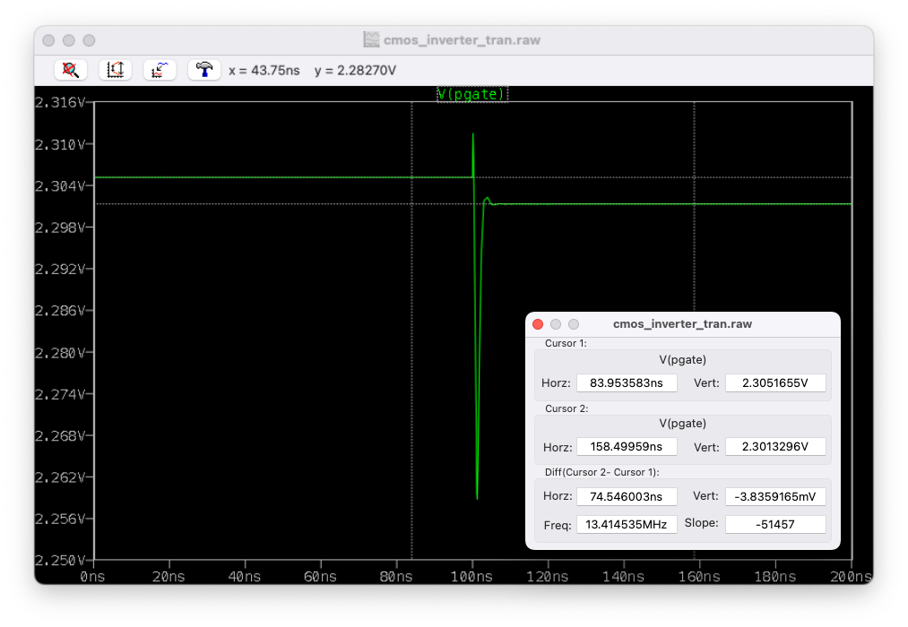

# Settling Behavior and Error

Consider a finite open-loop gain op-amp with a gain of $A_0$.

Connect this in negative feedback.

The closed loop gain is given by $\frac{A_0}{1+A_0}$.

The error voltage is given by $V_{E} = V_{OUT}/A_0 = \frac{1}{1+A_0}$.

Let us take a real schematic and slow down time domain response.

## Settling - Real Circuit

Consider the below circuit.

There are some pretty cool settling to learn from here. Let us start with the operation principle of this circuit.

* Input pair transistors (MN1 and MN2) form a differential pair.  
    * Say $V_{INP}$ > $V_{INN}$. MN1 will have higher $V_{GS}$ and hence higher $I_D$. Less current is sunk in the right branch.
    * Currents are equal when $V_{INP}$ = $V_{INN}$.
    * MP4 copies the current from MP3. At $V_{OUTP}$, higher current is pumped in by MP4 than taken out by MN2. The difference is sent to the load. This causes $V_{OUTP}$ node to rise.

Let us say we connected the above op-amp in unity gain feedback as shown below and an input of 1.8V is connected to $V_{INP}$. See a spice simulation result below.

Due to the finite gain of the op-amp, output did not settle to 1.8V. Instead, it settled to 1.804V. We will see the exact mechanism of this error later. Let us make some note of the behaviour of this error at this moment.

* Error = 1.804/1.8 = 0.22%.
* Increase the input to 2.8V. Error = 2.795/2.8 = -0.17%
* Set the input to 2.3V. Error = 2.3/2.3 $\approx$ 0%. What is special about 2.3V? This is the PMOS diode voltage. We will talk about all of this later.

Now, let us increase the input abruptly to 2.8V from 1.8V and look at:
* Input voltage
* Output voltage
* Internal gate voltage (PMOS gate) = PGATE

See a zoomed out view below.

In the zoomed out view, initially output is slightly higher than input and finally output is slightly lower than input. The values are same as the DC values.

See a zoomed in view below.

Initially, nothing will happen. The op-amp will be too sluggish to respond much. Almost all of the bias current will be in the left branch and this will be copied to the right side. For about 120mV input voltage movement, output voltage moves by 62mV. See this below.

Output will steadily increase. Eventually it will overshoot the input level at which point MN2 start taking more current. This will then settle back.

Notice how PGATE settles below.

PGATE never settles to the initial value. We will discuss this later.

# Common Mode Input in Unity Gain Feedback

See the circuit below.

* Say $V_{OUT} > PGATE$. $|V_{DS,MP3}| > |V_{DS,MP4}|$. This means $I_{D,Left} > I_{D,Right}$.

* However, this also means $|V_{DS,MN1}| < |V_{DS,MN2}|$. Which suggests $I_{D,Left} < I_{D,Right}$.

* Both of these cannot be true at the same time. The only possible solution is that the circuit tries to make $V_{out}$ equal to $PGATE$.

How to find the value of $PGATE$?

Let us start by making the circuit a "balanced" one. In a balanced circuit, the current will equally split between the branches. Say this equal current is $I_{D,CM}$. $PGATE$ is found by solving the below equation.

$$
I_{D,CM} = \frac{1}{2} C_{ox} \frac{W}{L} (|V_{GS0}|-|V_{TH}|)^2 \cdot (1+\lambda|V_{GS0}|)
$$

* If we connect the circuit in unit gain feedback with $V_{GS0}$ as input, it will now be a balanced circuit.

* $V_{INP} = 2.8V$ and is greater than PGATE. To a rough extend, we can say that the circuit will now have reduce the error using the factor $\frac{1}{A_0 \beta + 1}$.

The output cannot reach the full input level of 2.8V. It reaches a slightly lower level.

* Similarly, if we gave an input < PGATE, output will reach a value slightly greater than input level.

This analysis is not possible in two stage amplifiers (CS stage following differential pair). In this case, the output will sit at supply or ground depending on the process. From there, the error will reduce as a function of $\frac{1}{A_0 \beta + 1}$.

However, now the circuit is not a balanced one. $PGATE$ will not be equal to $V_{GS0}$. The current will be nearly balanced in both arms.

The new equation is:

$$
I_{D,CM} = \frac{1}{2}\mu C_{ox} \frac{W}{L} \bigr(|V_{GS,new}|-|V_{TH}|)^2\cdot \bigr(1+\lambda|V_{DS,new}|)
$$

Between the two equations, we can solve for $|V_{GS,new}|$.

$$
\bigr(|V_{GS,new}| - |V_{TH}|)^2 = \frac{(|V_{GS0}|-|V_{TH}|)^2 \cdot (1+\lambda|V_{GS0}|)}{\bigr(1+\lambda|V_{DS,new}|)}
$$

Note that $V_{DS,new}$ is not an unknown. It can be solved using the fact that error is reduced by $\frac{1}{A_0 \beta + 1}$. For a first order, we can ignore this error as well and say that $PGATE$ is a function of the input common mode.

# Mismatch

The question I am trying to answer here is:

**How does the op-amp mismatch appear at the output after connecting feedback?**

Mismatch is also similar to how the input referred noise behaves (except the one difference that noise also needs a current source representation to completely capture when there is finite loading from the source). Also, is there a difference if we refer the mismatch to + terminal v/s - terminal.

In the above circuit, there is no mismatch.

$$
V_{OUT} = V_{IN}
$$

There will be a settling errror given by $\frac{V_{IN} - V_{OUT0}}{A+1}$ where $V_{OUT0}$ is the default $V_{OUT}$ before feedback ($PGATE = V_{GS0}$ in the previous case).

Let us now consider a mismatch at the + terminal.

Negative feedback ensures that $V_X = V_{OUT}$.

$$
V_X = V_{IN} - V_{OFF}\\
\therefore\ V_{OUT} = V_{IN} - V_{OFF}
$$

The offset voltage appear as is at the output.

Let us now consider a mismatch at the -ve terminal.

Negative feedback ensures that $V_X = V_{IN} = V_{OUT} - V_{OFF}$.

Thus, $V_{OUT} = V_{IN} + V_{OFF}$. Here, the sign is different compared to previous case because offset is at the negative terminal.

Same method can be applied with a feedback factor also. Say feedback factor is $\beta$ . Let us take the - terminal. 

$$
V_{OUT} = (V_{IN} - V_X)\cdot A \\
\newline
V_X = V_{OUT} \cdot \beta - V_{OFF} \\
\newline
V_{OUT} = (V_{IN} - V_{OUT}\cdot \beta - V_{OFF})\cdot A \\
\newline
V_{OUT} \cdot (1+A\beta) = (V_{IN} - V_{OFF})\cdot A \\
\newline
V_{OUT} = V_{IN}\cdot \frac{A}{1+A\beta} - V_{OFF}\cdot \frac{A}{1+A\beta}
$$

$$
V_{OUT} \approx \frac{V_{IN}}{\beta} - \frac{V_{OFF}}{\beta}
$$

Just to be comfortable, see this offset at transistor level below.

# Auto Zero

Consider the following amplifier.

Above is the auto zero phase. It is unity gain feedback. $V_{CM} = V_Y $. Note that, in this phase, $V_{Y1} = V_{OUT} $. This gives $V_Y = V_{OUT} - V_{OFF} $.

Thus, the voltage across $C_{IN} $ is given by $V_{OUT} - V_{IN0} = V_{CM} + V_{OFF} - V_{IN0} $. The polarity of this voltage is + at $V_{Y1} $ and - at $V_{IN0} $.

Now, let us remove auto zero and give a voltage transition at $V_{IN} $. See this below.

Now, the voltage at $V_Y$ is given by:

$$
V_{IN1} + V_{C_{IN}} - V_{OFF} = V_{IN1} + V_{CM} + V_{OFF} - V_{IN0} - V_{OFF} = V_{IN1} - V_{IN0} + V_{CM}
$$

See how the offset is removed. The cap stored the offset in the opposite direction. The change in $V_{IN}$ is driven on top of $V_{CM}$. 

Note that this offset cancellation is dependent on the finte op-amp gain.

